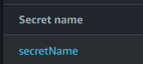
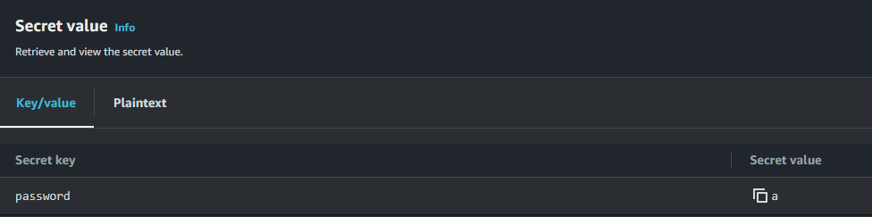
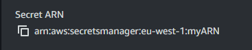

# AWS Lambda for Secrets Manager Rotation

This project contains a AWS Lambda function for rotate secret in the service AWS Secret Manager, the IAM policy for the lambda and a texte file with all AWS CLI command for manage secret manager !

## Project Structure

- **images folder** : Folder with all images and screenshot for the Readme.
- **Lambda_code** : The code for the AWS Lambda function that rotates the secrets.
- **IAM_policy** : The policy that grants the Lambda function the required permissions to access and update secrets in AWS Secrets Manager in JSON format.
- **Secret_aws_cli** : Documentation in text format containing all the commands to manage a secret using the AWS CLI. 

## Changes Variables  
- **In Lambda code** : 
```shell
getRes = client.get_secret_value(
        SecretId = 'SecretName' 
    )
```
The SecretId is the name of the secret in AWS



```shell
current_secrets.update({
        "password" : newPassword
    })
```

The "password" reference to the secret key directly in the secret 


- **In IAM Policy** : 
```shell
"Resource": "ARN_OF_YOUR_SECRET"
		},
```
ARN_OF_YOU_SECRET is basicly the arn of your secret



- **In AWS CLI File**
You have the reference to the region and the profile. Because in my case i don't add region in my aws redentials file and i specify the profile because i have a multiple aws environnement in my aws credential

```shell
--profile MY_PROFILE --region MY_REGION
```

You can export vars in cli
```shell
EXPORT MY_PROFILE=your aws profile name 
EXPORT MY_REGION=eu-west-1
```